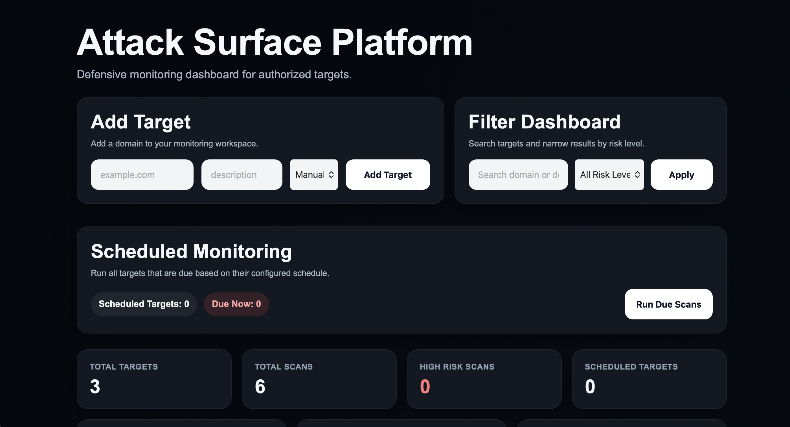

# Attack Surface Platform


A defensive web security monitoring platform for analyzing the exposure of authorized targets.

The platform provides a simple **attack surface management dashboard** that allows users to add domains, run security scans, analyze security indicators, and track exposure over time.

The goal of this project is to demonstrate practical skills in:

- backend development
- web application architecture
- security tooling
- network analysis
- dashboard-based reporting

---

# Dashboard



The dashboard allows security monitoring of authorized domains and visualizes risk indicators in a simple web interface.

---

# Overview

Attack Surface Platform helps visualize the **external exposure of web targets** through a simple monitoring interface.

Users can:

- add domains to monitor
- run scans on demand
- inspect discovered technologies and open ports
- analyze HTTP security headers
- inspect TLS configuration
- view structured security findings
- track scan history
- compare scan results over time
- export reports

This project focuses on **defensive security analysis and educational use**.

---

# Key Features

### Target Management
Add and monitor authorized domains through the dashboard.

### Automated Security Scanning
Run scans that analyze various aspects of a target’s attack surface.

### Security Headers Analysis
Detect missing or insecure HTTP security headers.

### TLS Inspection
Check TLS configuration and detect outdated or insecure TLS versions.

### Open Port Discovery
Identify potentially exposed network ports.

### Technology Detection
Basic fingerprinting of detected technologies.

### Subdomain Discovery
Discover publicly exposed subdomains.

### Risk Scoring Engine
Calculate a simplified risk score based on scan findings.

### Structured Findings Viewer
Display vulnerabilities and security issues in categorized cards.

### Scan History
Track scans performed against each target.

### Risk Trend Visualization
View how risk scores evolve over time.

### Scan Comparison
Compare the latest scan against the previous one to detect:

- new findings
- resolved findings
- persistent findings

### Export Reports
Export scan results as:

- JSON
- HTML

---

# Technology Stack

## Backend
- Python
- FastAPI

## Database
- SQLite
- SQLAlchemy ORM

## Frontend
- HTML
- Jinja2 Templates
- CSS

## Networking / Security
- HTTPX
- SSL inspection
- Socket-based checks

---

# Project Structure
attack-surface-platform/
│
├── app/
│ ├── db/
│ ├── models/
│ ├── routes/
│ ├── services/
│ ├── static/
│ └── templates/
│
├── assets/
│ └── dashboard.png
│
├── attack_surface.db
├── requirements.txt
└── README.md

---

# Installation

## 1. Clone the repository

```bash
git clone https://github.com/xanast/attack-surface-platform.git
cd attack-surface-platform
2. Create a virtual environment
python3 -m venv .venv
3. Activate the environment
Mac / Linux
source .venv/bin/activate
Windows
.venv\Scripts\activate
4. Install dependencies
pip install -r requirements.txt
5. Run the application
uvicorn app.main:app --reload
6. Open the dashboard
http://127.0.0.1:8000
Example Workflow

```
---

## Add an authorized domain

Run a security scan

Review security findings

Inspect technologies and open ports

Analyze risk score

Compare with previous scans

Export reports if needed


## Security Notice

This project is intended only for authorized security testing and defensive monitoring.
Do not scan systems, domains, or infrastructure without explicit permission.
The platform is designed for educational and portfolio purposes and should not be treated as a production-grade penetration testing framework.

## Future Improvements

background scanning workers

improved scan scheduling

advanced risk scoring model

vulnerability database integration

authentication system

REST API for scan management

enhanced reporting

production deployment support

## Author

Anastasios Makrygiannis

Computer Science student focused on backend development, networking, and security tooling.

GitHub
https://github.com/xanast


---
## Live Demo

🔗 https://attack-surface-platform.onrender.com
